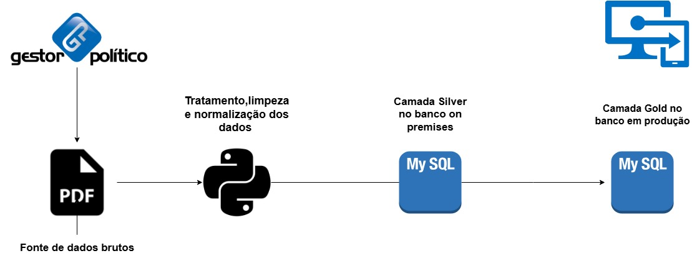

# 🔄 ETL de Atendimentos - Extração de PDFs do Gestor Político para MySQL

Este projeto consiste em um pipeline ETL desenvolvido em **Python** para extrair, tratar e estruturar dados brutos de atendimentos extraídos de arquivos **PDF** gerados pelo sistema **Gestor Político**.  

Os dados tratados são armazenados localmente em um banco de dados **MySQL (Camada Silver)** e, após validação, migrados para o ambiente de produção do sistema **Gabinete Online (Camada Gold)**.

---

## 🧩 Tecnologias Utilizadas

- Python 3.13
- `pdfplumber` (extração de texto de arquivos PDF)
- `pandas` (manipulação e estruturação dos dados)
- `mysql-connector-python` (integração com banco MySQL)
- MySQL local (XAMPP) e remoto (produção)

---

## ⚙️ Funcionalidades

- Leitura e extração automatizada de atendimentos em arquivos PDF
- Tratamento, limpeza e normalização dos dados extraídos
- Armazenamento dos dados tratados no banco **on-premises (Silver)**
- Envio dos dados validados para o banco **de produção (Gold)**
- Pipeline reutilizável para novos arquivos PDF exportados do sistema

---

## 🧠 Motivação

Este projeto foi desenvolvido com base em uma **necessidade real de automação** do fluxo de dados entre o sistema **Gestor Político** e o sistema interno **Gabinete Online**, visando eliminar processos manuais de lançamento de atendimentos , oque levou a necessedidade de um pipeline ETL que também padroniza os dados no formato no novo sistema .

A estrutura do pipeline segue o conceito moderno de **camadas de dados** (Bronze/Silver/Gold), aplicando boas práticas de engenharia de dados mesmo em projetos locais.

---

## 📁 Estrutura do Projeto
etl_gestor_politico/
├── etl_gestor.py # Script principal de ETL
├── base_dados.pdf # Arquivo PDF com os dados brutos de atendimento
├── ETL_Gestor.jpg # Arquitetura do processo (imagem)
└── README.md # Documentação do projeto

